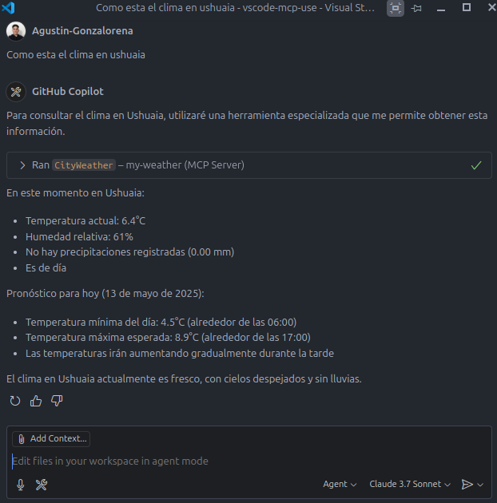

# MCP Clima
Recibiendo una ciudad como parametro, responde con el clima actual de esa ciudad.

Api de clima utiliizada: https://open-meteo.com/
## Como ejecutarlo:
Solo se puede ejecutar de manera local, correrlo primero desde intellij

### Modo testing:
- Usando la herramienta MCP Inspector   

        npx -y @modelcontextprotocol/inspector ./run-mcp.sh

### Integrar en vscode o claude:
- Para poder conversar con los modelos. 
 
        "mcp": {
            "servers": {
                "my-weather": {
                "type": "stdio",
                "command": "/DIRECTORIO-DEL-PROYECTO/run-mcp.sh"
            }
        }

